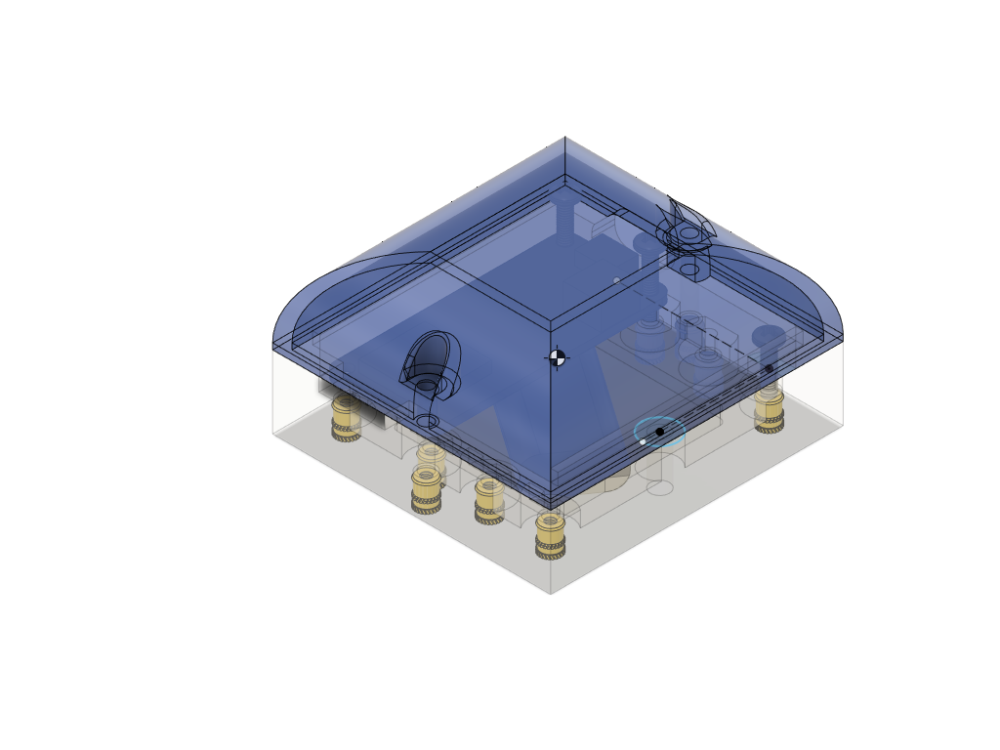

# Sidekick
**An experimental logger for skydivers**

This is a stand-alone, battery-powered data logger designed to be
carried by a skydiver during their jump.  It includes a GPS, IMU, and altitude sensors. Data from all sensors is logged onto a Micro-SD card. The logged data can be reviewed post-jump by to-be-designed software.

The current sidekick design is composed of four off-the-shelf boards:

* Adafruit Feather M0 Adalogger - https://www.adafruit.com/product/2796
* Adafruit Ultimate GPS FeatherWing - https://www.adafruit.com/product/3133
* Adafruit MPU-6050 6-DoF Accel and Gyro Sensor - STEMMA QT Qwiic - https://www.adafruit.com/product/3886
* Adafruit DPS310 Precision Barometric Pressure / Altitude Sensor - STEMMA QT / Qwiic - https://www.adafruit.com/product/4494
* 2500 mAH LiPoly 3.7V rechargeable battery 

## Directory Structure
* **enclosure** - Fusion 360 enclosure; designed to be 3D-printed
* **src** - Arduino-based firmware for the microcontroller
* **images** - supporting images and videos

## Specifications

Power: rechargeable 2500mAh Li-Polymer battery

Storage: removable microSD card

Log file format: one log file for each jump; raw log format is an extension of NMEA0183. Details to follow.

USB micro-B connector (for recharging and programming)

Bootloader programmed via a 10-pin J-Link compatible connector; routine Arduino programming via the USB connector.

## Enclosure Notes
The enclosure is designed to be 3D printed. Tolerances between the upper enclosure, lower enclosure, and the PCB
are quite tight - printing precision will be important. Since 3D printing technologies will vary in their precision, 
you may need to scale or otherwise modify the objects to adequately match the final measurements in the original design.

For example, I printed the prototype enclosure on a MakerBot Replicator 2 (PLA) printer.  Using the default print settings
I know that an object will shrink typically by about 1% post-printing.  I set the scale to 101% to compensate for that 
in the MakerBot Desktop tooling and the end result works well.

## Credits
This PCB design uses several Adafruit Feather and Stemma QT sensor boards.  Adafruit maintains a family of excellent
microcontroller and sensor evalation boards and companion software.  Support them. They deserve it.

The enclosure for this project was designed using the personal edition of Fusion 360. Autodesk supports the Maker community
through access to this epic design tool.  Try it out.

## Disclaimer
THE SOFTWARE IS PROVIDED "AS IS", WITHOUT WARRANTY OF ANY KIND, EXPRESS OR
IMPLIED, INCLUDING BUT NOT LIMITED TO THE WARRANTIES OF MERCHANTABILITY,
FITNESS FOR A PARTICULAR PURPOSE AND NONINFRINGEMENT. IN NO EVENT SHALL THE
AUTHORS OR COPYRIGHT HOLDERS BE LIABLE FOR ANY CLAIM, DAMAGES OR OTHER
LIABILITY, WHETHER IN AN ACTION OF CONTRACT, TORT OR OTHERWISE, ARISING FROM,
OUT OF OR IN CONNECTION WITH THE SOFTWARE OR THE USE OR OTHER DEALINGS IN THE
SOFTWARE.

